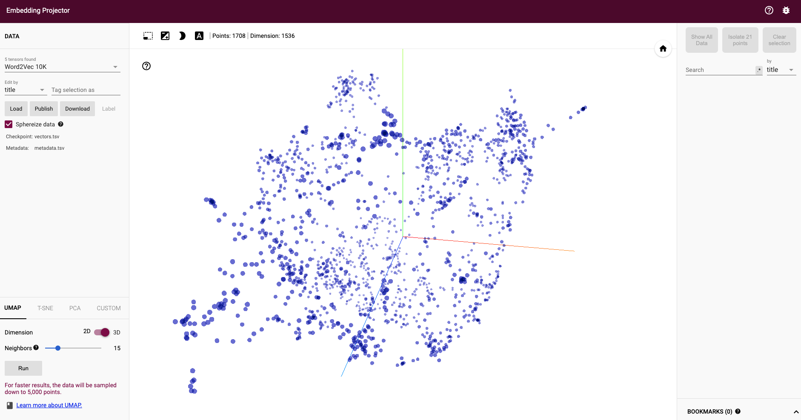
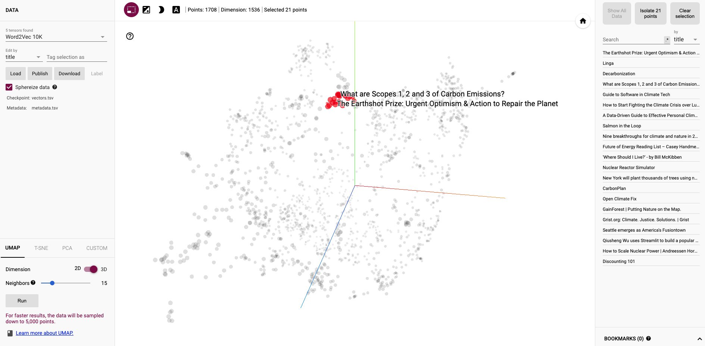
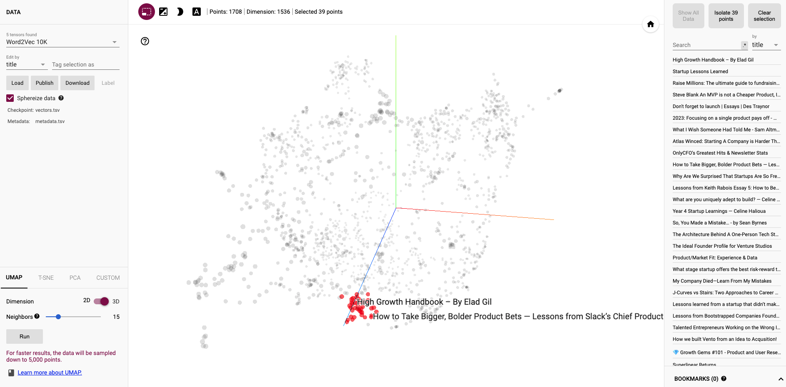
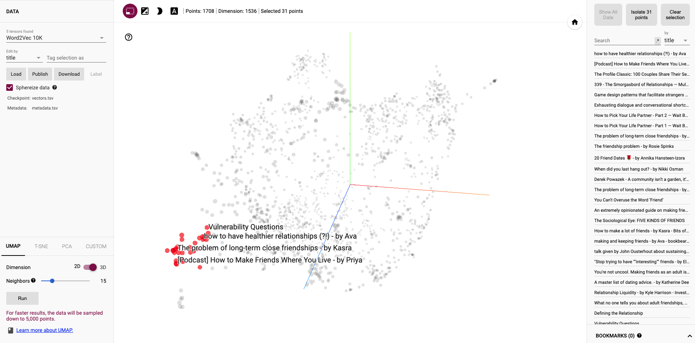
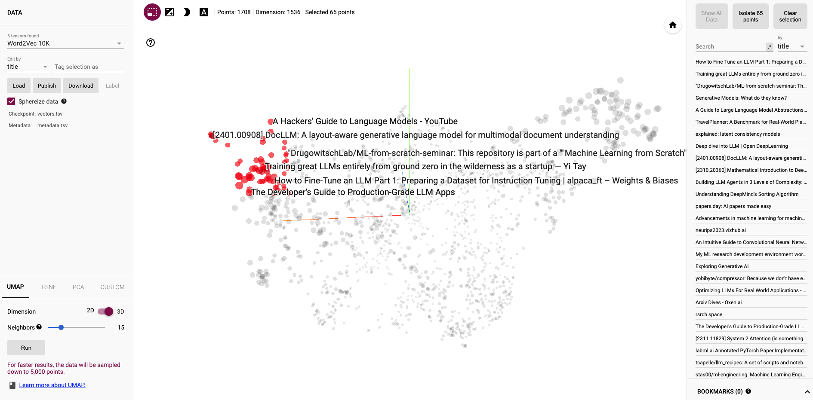
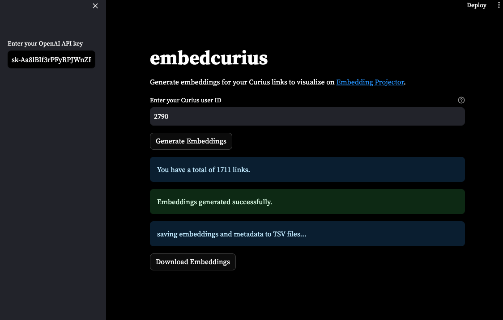
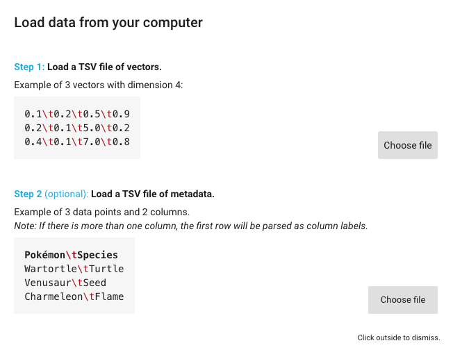

# embedcurius

Using [The Embedding Projector](https://projector.tensorflow.org/) ([paper](https://arxiv.org/pdf/1611.05469.pdf)) visualize [curius](https://curius.app/benedict-neo) links.

Embeddings using OpenAI's [latest](https://openai.com/blog/new-embedding-models-and-api-updates) `text-embedding-3-small`



## examples

on climate



on startups



on friendships



on AI



## how to find your curius id

1. go to your bookshelf
2. right click > inspect
3. go network tab
4. find you name (example below)


## how to run

### use the app



### use python

install requirements

```bash
pip install requirements.txt
```

set these variables

```python
OPENAI_API_KEY = "<YOUR_OPENAI_API_KEY>"
CURIUS_ID = "<YOUR_CURIUS_ID>"
```

run the function

```python
python embed.py
```

once you have `vectors.tsv` and `metadata.tsv`

load them respectively



have fun!
